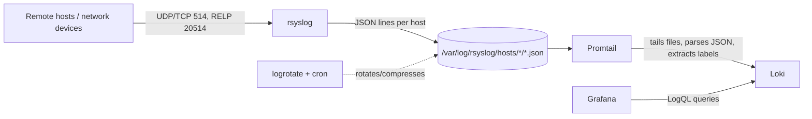

# Syslog Stack - rsyslog + Promtail + Loki + Grafana

A self-hosted centralized logging system: any device that can send syslog
(Linux servers, network switches/firewalls, routers, IoT gear) ships logs
here, and Grafana gives you dashboards, filtering, and log search.

## Architecture



- **rsyslog** - receives syslog over UDP/TCP port 514 and RELP port 20514
  (reliable TCP), writes one JSON object per line, one file per source
  host, under `data/rsyslog/hosts/<hostname>/syslog.json`.
- **Promtail** - tails those JSON files, parses each line, and promotes
  `host`, `severity`, `facility`, `app` to Loki labels.
- **Loki** - stores and indexes the log stream (filesystem backend, TSDB
  index, 14-day retention via the compactor).
- **Grafana** - pre-provisioned with the Loki datasource and a "Syslog
  Overview" dashboard (log volume, severity/facility breakdowns, top
  hosts/apps, live log streams, error feed).
- **logrotate + cron** run inside the rsyslog container so the JSON log
  files don't grow unbounded (daily rotation, 14 generations, gzip).

## Quick start

```bash
cd /home/d4rk_katt/syslog
docker compose up -d --build
```

Then open Grafana at **http://localhost:3000**.

- Username: `admin`
- Password: see `.env` (`GRAFANA_ADMIN_PASSWORD`) - it was generated
  randomly during setup. Change it after first login.

The "Syslog Overview" dashboard lives in the **Syslog** folder and is
provisioned automatically - no manual import needed.

## Verifying it works

Generate some sample traffic (spans 5 fake hosts, 6 fake apps, a mix of
severities, over both UDP and TCP):

```bash
./scripts/generate-test-logs.sh
```

Then check:

```bash
# raw files rsyslog wrote
ls data/rsyslog/hosts/
tail -f data/rsyslog/hosts/web01/syslog.json

# confirm Loki has ingested them
curl -s http://localhost:3100/loki/api/v1/label/host/values | jq
```

...and refresh the Grafana dashboard - you should see log volume, host,
and severity panels populate within a few seconds.

## Pointing real systems at this collector

Replace `<this-host>` with this machine's IP/hostname.

**Linux server (rsyslog client, forward everything):**
Copy [`clients/linux/rsyslog-forward.conf`](clients/linux/rsyslog-forward.conf)
to `/etc/rsyslog.d/60-forward.conf` on the client, replace
`SYSLOG_SERVER` with this machine's IP/hostname, and
`sudo systemctl restart rsyslog`.

**Linux server (systemd/journald, no rsyslog installed):**
Install `rsyslog` (it picks up journald automatically via `imjournal`) and
use the forwarding rule above, or point `systemd-journal-upload` at a
separate collector if you'd rather avoid rsyslog on the client.

**Windows server (via Fluent Bit — recommended):**
Windows Event Log isn't syslog, so it needs a converter. This stack uses
[Fluent Bit](https://fluentbit.io/) (free, fully open-source, no
edition tiers) with its native `winlog` input and `loki` output — it
reads the Windows Event Log and pushes straight to Loki at
`http://<this-host>:3100`, bypassing rsyslog entirely.

1. Install Fluent Bit on the Windows host using the official installer
   from [fluentbit.io/download](https://fluentbit.io/download) (default
   path: `C:\Program Files\fluent-bit\`). The installer does **not**
   register a Windows service on its own — that's a separate step below.
2. Copy [`clients/windows/fluent-bit.conf`](clients/windows/fluent-bit.conf)
   over `C:\Program Files\fluent-bit\conf\fluent-bit.conf`, replacing
   `SYSLOG_SERVER` with this machine's IP/hostname.
3. Register and start the service (Administrator PowerShell, one-time):
   ```powershell
   New-Service fluent-bit -BinaryPathName '"C:\Program Files\fluent-bit\bin\fluent-bit.exe" -c "C:\Program Files\fluent-bit\conf\fluent-bit.conf"' -StartupType Automatic
   Start-Service fluent-bit
   ```
   To apply config changes later: `Restart-Service fluent-bit`.
4. Allow outbound TCP 3100 through the Windows firewall if needed.

Because this pushes directly to Loki instead of going through rsyslog,
it lands under a separate `job="windows_events"` label rather than
`job="syslog"`, so it has its own dashboard: **Windows Event Log**
(provisioned automatically at `grafana/dashboards/windows-events.json`,
same "Syslog" folder). Structured fields (Channel, Event ID, Message)
are kept as JSON in the log body rather than promoted to Loki labels
(those values are high-cardinality, which is bad practice for labels) —
query them at view-time with LogQL, e.g. `{job="windows_events"} | json`.
Exact field names can vary slightly by Fluent Bit version; check one
real event in Grafana Explore after your first run and adjust the
"Events by Channel" panel query if needed — see the note at the bottom
of `fluent-bit.conf`.

**Windows server (via NXLog — alternative):**
If you'd rather keep every device in the exact same `job="syslog"`
pipeline/dashboard (at the cost of losing structured fields, just a
flattened message string), use
[NXLog Community Edition](https://nxlog.co/community) instead — also
free. Config: [`clients/windows/nxlog.conf`](clients/windows/nxlog.conf)
→ `C:\Program Files\nxlog\conf\nxlog.conf`, replace `SYSLOG_SERVER`,
restart the `nxlog` service. It ships event log entries as RFC5424
syslog, so the host shows up in the existing Syslog Overview dashboard's
host filter automatically, no separate dashboard needed.

**Network devices (Cisco/Juniper/pfSense/OPNsense/UniFi, etc.):**
Every vendor has a "syslog server" field in system logging settings - set
it to `<this-host>` on UDP port 514. Most also let you pick a minimum
severity to forward; start with `info` and narrow later once you see
volume.

**Reliable delivery (RELP):** if UDP loss is a concern (e.g. WAN links),
point clients that support RELP (`rsyslog` with `omrelp`) at port
`20514/tcp` instead of 514.

## Data layout & retention

- Raw JSON logs: `data/rsyslog/hosts/<hostname>/syslog.json`, rotated
  daily and kept for 14 days (gzip after 1 day) - see
  `rsyslog/logrotate.conf`.
- Loki chunks/index: `data/loki/` - retained 14 days
  (`limits_config.retention_period` in `loki/loki-config.yml`), enforced
  by the compactor. Change that value (and re-run `docker compose up -d`)
  to keep logs longer or shorter.
- Grafana state (dashboards, users, prefs): `data/grafana/`.

All three are bind-mounted under `./data/` so `docker compose down` never
loses data; only `docker compose down -v` touches the named
`promtail-positions` volume (safe - it just re-reads existing files from
the start on next boot, so you may see a batch of "old" logs re-ingested
once).

## Security notes (read before exposing this beyond your LAN)

This setup is tuned for a home lab / internal network:

- Syslog over UDP/TCP 514 is **plaintext and unauthenticated** - anyone
  who can reach port 514 can inject fake log entries. Keep it behind a
  firewall/VPN; don't expose it to the public internet.
- RELP on 20514 is more reliable than UDP but is **not encrypted** in
  this config. For encryption in transit, rsyslog supports TLS-wrapped
  RELP (`tls="on"` + certificates) - ask if you want this wired up.
- Grafana is served over plain HTTP on port 3000. Put it behind a
  reverse proxy with TLS (Caddy/nginx/Traefik) if it needs to be reached
  outside `localhost`.
- Change the generated Grafana admin password after first login.
  Self-registration is already disabled (`GF_USERS_ALLOW_SIGN_UP=false`)
  so nobody else can create an account.

## Extending

- **Alerting**: add a Grafana alert rule on the "Error/Critical.../range"
  stat panel (e.g. fire when > N errors in 5m) and wire a contact point
  (Slack/email/webhook).
- **More label extraction**: edit `promtail/promtail-config.yml` to pull
  additional structured fields (e.g. HTTP status codes from nginx logs)
  into labels or just leave them in the log line for full-text search.
- **High log volume**: if a single app/host produces very high
  cardinality values, avoid turning those into Loki labels (keep them in
  the log body) - Loki performance degrades with high label cardinality.
- **Scale out**: this is a single-node stack. For larger fleets, Loki
  can run in distributed mode with object storage (S3/GCS) instead of
  the local filesystem backend used here.

## Troubleshooting

```bash
docker compose logs -f rsyslog     # confirm messages are being received
docker compose logs -f promtail    # confirm files are being tailed/shipped
docker compose logs -f loki        # confirm ingestion, check for errors
docker compose ps                  # all 4 containers should be "Up"
```

If Promtail shows `permission denied` reading log files, check
`data/rsyslog/hosts/*/*.json` are world-readable (rsyslog creates them
`0644` by default - see `rsyslog/rsyslog.conf`).


